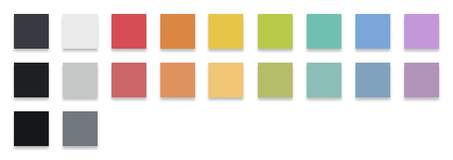
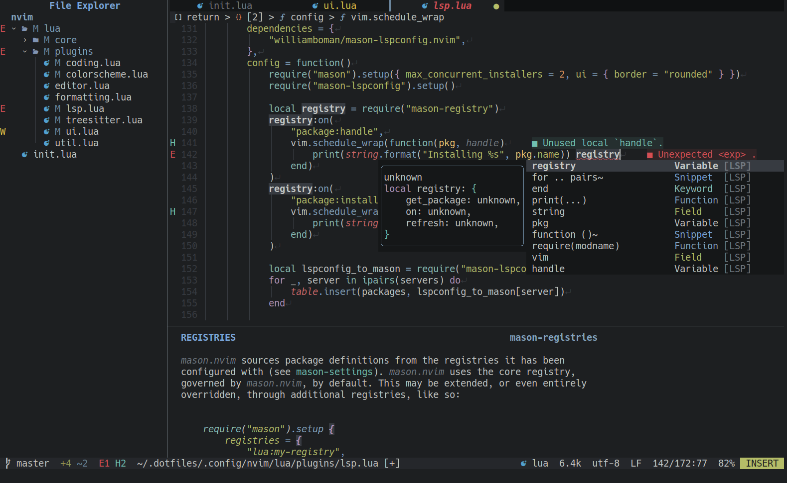

<div align="center">

# hybrid.nvim

A dark [Neovim](https://github.com/neovim/neovim) theme written in [Lua](https://www.lua.org).

<details open>
<summary>Palette</summary>
<br>



</details>
<br>

<details open>
<summary>Screenshot</summary>
<br>



</details>
<br>

</div>

## Prerequisites

Neovim 0.8.0+

## Installing

Using `packer`

```lua
use { "HoNamDuong/hybrid.nvim" }
```

Using `lazy.nvim`

```lua
{
    "HoNamDuong/hybrid.nvim",
    lazy = false,
    priority = 1000,
    opts = {},
}
```

## Usage

Inside `init.vim`

```vim
colorscheme hybrid
```

Inside `init.lua`

```lua
vim.cmd.colorscheme("hybrid")
```

## Configuration

```lua
-- Default options:
require("hybrid").setup({
    terminal_colors = true,
    undercurl = true,
    underline = true,
    bold = true,
    italic = {
        strings = false,
        emphasis = true,
        comments = true,
        folds = true,
    },
    strikethrough = true,
    inverse = true,
    transparent = false,
    overrides = function(highlights, colors) end,
})
```

## Overrides

`config.overrides(highlights, colors)` can be used to override highlight groups.

For default values of `colors` and `highlights`, please consult [colors](./lua/hybrid/colors.lua), and [highlights](./lua/hybrid/highlights.lua).

```lua
require("hybrid").setup({
    overrides = function(hl, c)
        local background = "#1d1f21"
        hl.TelescopeNormal = {
            fg = c.fg,
            bg = background,
        }
        hl.TelescopeBorder = {
            fg = c.fg_hard,
            bg = c.bg,
        }
        hl.TelescopeTitle = {
            fg = c.fg_hard,
            bg = c.bg,
            bold = true,
        }
    end,
})
```

Please note that the override values must follow the attributes from the highlight group map, such as:

-   **fg** - foreground color
-   **bg** - background color
-   **bold** - true or false for bold font
-   **italic** - true or false for italic font

Other values can be seen in [here](<https://neovim.io/doc/user/builtin.html#synIDattr()>).

## Inspiration

-   [vim-hybrid](https://github.com/w0ng/vim-hybrid)
-   [vim-tomorrow-theme](https://github.com/chriskempson/vim-tomorrow-theme)
-   [tokyonight.nvim](https://github.com/folke/tokyonight.nvim)
-   [gruvbox.nvim](https://github.com/ellisonleao/gruvbox.nvim)
-   [kanagawa.nvim](https://github.com/rebelot/kanagawa.nvim)
